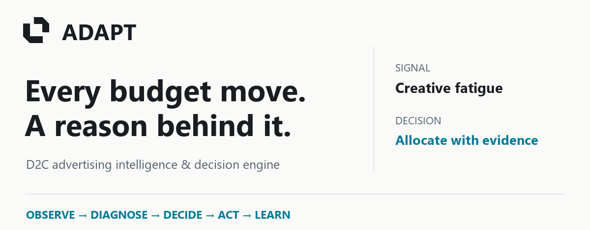
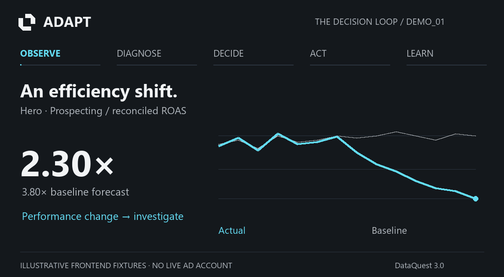
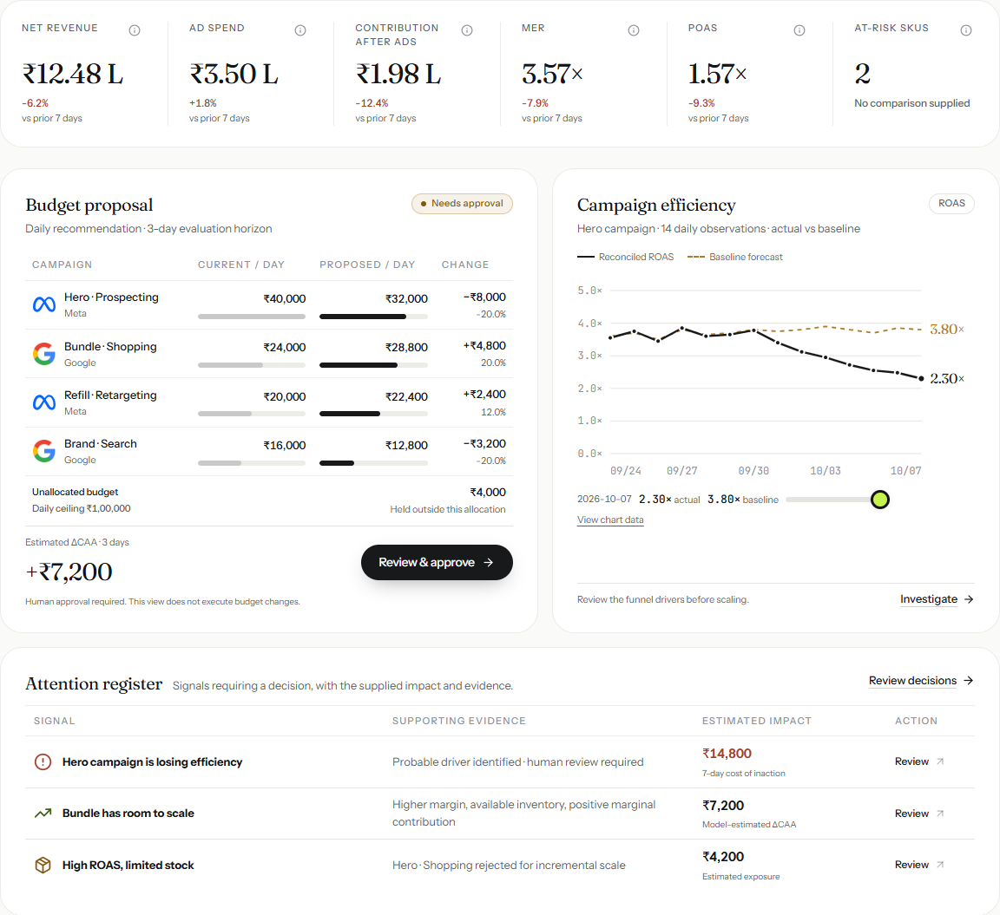
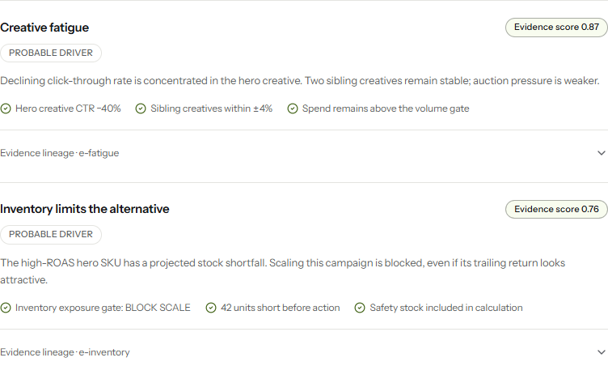
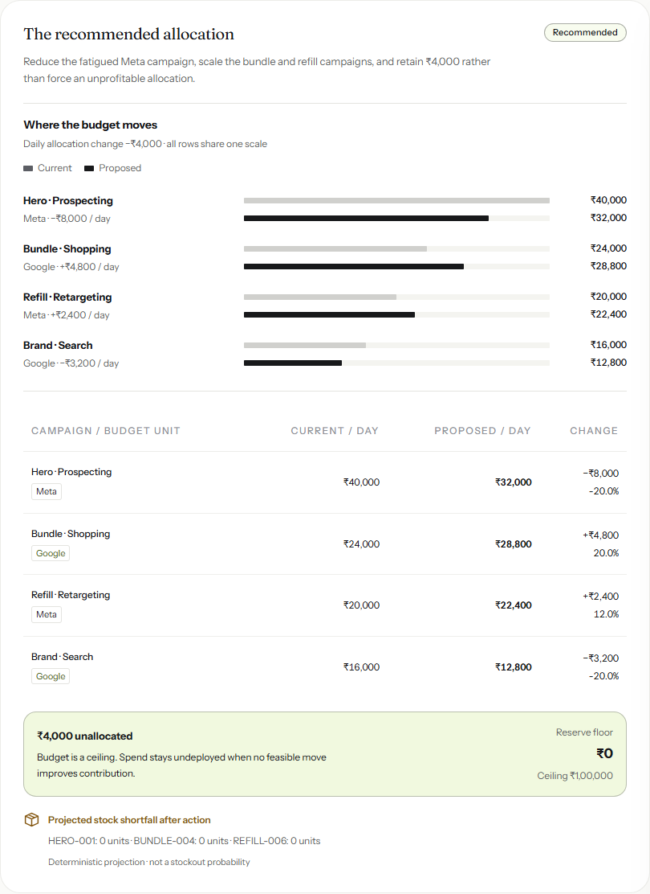
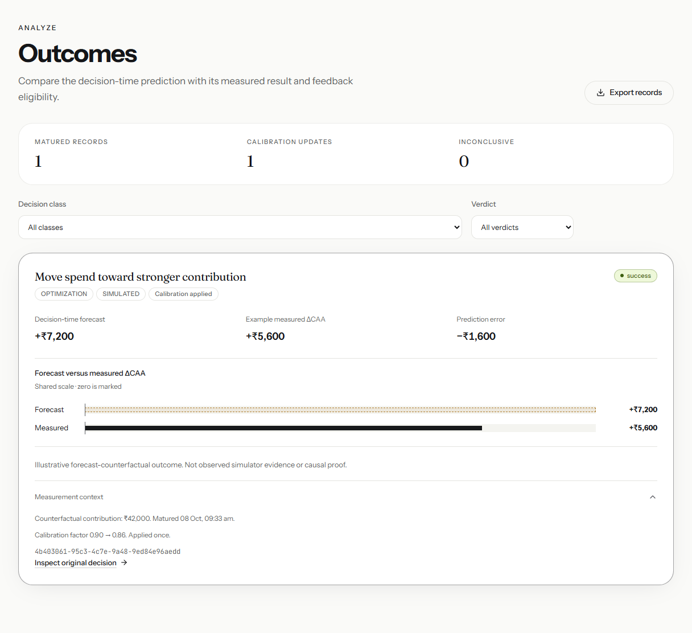
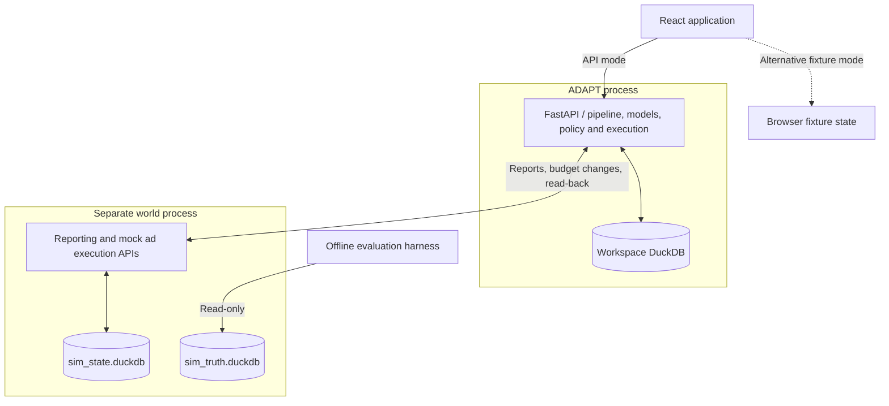

<picture>
  <source media="(prefers-color-scheme: dark)" srcset="./docs/assets/readme/hero-dark.png">
  <source media="(prefers-color-scheme: light)" srcset="./docs/assets/readme/hero-light.png">
  
</picture>

ADAPT combines campaign performance, SKU economics and inventory context to recommend where the next rupee of ad spend should go. Each decision carries its evidence, forecast, policy checks and execution history.

**[Try the frontend demo](https://muhammedamaan790.github.io/ADAPT/)** · [Product](#product) · [Architecture](#architecture) · [Setup](#setup) · [60-second walkthrough](#60-second-walkthrough)

Built for **DataQuest 3.0**. The hosted demo runs **illustrative browser fixtures**. The Python engine and simulated ad world run locally; GitHub Pages does not host them.

## From a signal to a decision

<picture>
  <source media="(max-width: 600px)" srcset="./docs/assets/readme/decision-loop-mobile.png">
  <source media="(prefers-reduced-motion: reduce)" srcset="./docs/assets/readme/decision-loop-poster.png">
  
</picture>

*A 7.25-second visual explanation using the existing DEMO_01 frontend fixtures. ₹7,200 forecast and ₹5,600 outcome are illustrative 3-day values, not measured advertising uplift. [Static story](./docs/assets/readme/decision-loop-mobile.png) · [MP4](./docs/assets/readme/adapt-decision-loop.mp4) · [Asset provenance](./docs/assets/readme/provenance.json)*

## Why ADAPT exists

A strong ROAS can hide a weak margin or a product about to run out of stock. An apparent campaign failure can be a reporting failure. ADAPT joins these signals before recommending a budget change, then records what happened after the change.

| Stage | What the implementation does |
| :--- | :--- |
| **Observe** | Ingest ads, orders, sessions, inventory and economics; reconcile canonical records and data health. |
| **Diagnose** | Separate material efficiency changes from tracking problems and expected changes; decompose the funnel and rank evidence. |
| **Decide** | Estimate response curves and inventory exposure; allocate against contribution, risk and guardrails. |
| **Act** | Apply channel policy, check decision identity and dependencies, set absolute budgets and verify by read-back. |
| **Learn** | Measure matured outcomes against a frozen forecast counterfactual; update optimism correction and qualification evidence. |

## Product

### The command center

Business performance, a concrete budget proposal and the signals requiring attention share one working surface.

<picture>
  <source media="(prefers-color-scheme: dark)" srcset="./docs/assets/readme/command-center-dark.png">
  
</picture>

### Evidence before approval

The Decision Center connects a performance shift to a probable driver, an inventory constraint and an actionable allocation. Alternative receivers can be blocked even when their historical ROAS looks attractive.

<details>
<summary>Inspect the diagnosis and allocation screens</summary>





</details>

### Inventory-aware spend

The Inventory page lists every SKU with available stock, 7-day versus 28-day sell rate, days of cover, inbound units and attributed ad spend. A rule-based recommendation (restock, hold ad spend, expedite, clear excess, scale or watch) and an alert feed sit beside it, so ad spend is read against stock. [Inventory API](./adapt/backend/adapt/api/routers/data.py).

### Close the loop

Approval leads to an execution record, followed by an outcome comparison and a visible calibration update. An uncertain external state stays uncertain until read-back resolves it.



All screenshots capture the unchanged application at the audited revision. They show the browser fixture flow, not fitted model results or the simulator’s hidden truth.

## Architecture



The API owns one workspace writer and orchestrates ingestion, reconciliation, detection, diagnosis, prediction, allocation and feedback. World APIs simulate ads, store, GA4, ERP and finance. The optional Google live adapter and Groq narration connect from the backend; they are not required for mock operation.

The frontend selects fixture or API mode explicitly. The engine cannot import the world or evaluation packages; import-linter checks that boundary. Outside the simulator, only the offline harness can inspect hidden truth. Groq explains evidence and answers read-only questions; it does not choose budgets.

<details>
<summary>Decision engine: the interesting parts</summary>

**Detection.** STL-based forecasts, robust residual scores and PELT shifts are kept separate from rupee materiality. The main rule is `MATERIAL AND (STAT OR SHIFT)`, with a separate collapse path. Eligibility and fit windows precede evaluated days. [Implementation](./adapt/backend/adapt/detect/detector.py).

**Diagnosis.** On window totals, `ROAS = CTR × CVR × AOV × 1000 / CPM`. Log-factor contributions sum to the log ROAS change; midpoint rate/mix decomposition separates segment performance from composition changes. Evidence ranking is distinct from causal estimation. Synthetic control and difference-in-differences expose diagnostic gates and return no estimate when gates fail. Passing those gates does not prove identification. [Decomposition](./adapt/backend/adapt/diagnose/decomposition.py) · [Causal estimators](./adapt/backend/adapt/diagnose/causal/estimate.py).

**Prediction.** Hill saturation curves with geometric adstock estimate attributed net revenue. Chronological train, promotion and diagnostic windows prevent overlap. Accepted response curves use 200 joint moving-block bootstrap draws; rejected fits fall back to pooled curves or `MODEL_UNAVAILABLE`. Demand uses a seasonal-naive baseline or a promoted LightGBM quantile model. A Beta-Binomial CVR prior uses estimated SKU click allocation. The structured creative prior reads attributes, not image or copy content, and is withheld if promotion criteria fail; when accepted, the Learning page scores chosen format, hook, CTA, category and channel levels against it. [Creative prior](./adapt/backend/adapt/predict/creative_model.py) · [Response curves](./adapt/backend/adapt/predict/curves.py) · [Promotion](./adapt/backend/adapt/predict/fit_curves.py) · [Demand](./adapt/backend/adapt/predict/demand.py).

**Allocation.** Contribution before ads is net revenue minus COGS, shipping and payment fees; contribution after ads subtracts ad spend. The profit objective maximizes `E[ΔCAA] − λ(E[ΔCAA] − P10[ΔCAA])`. Greedy marginal allocation is polished with SLSQP, validated, rounded, repaired and validated again. Constraints include budget/reserve, daily movement, channel shares, inventory and source/model availability. Unallocated money is allowed. Growth and inventory-clearance objectives are also implemented. There is no global-optimality claim. [Optimizer](./adapt/backend/adapt/decide/optimizer.py).

**Execution.** Decisions have content hashes and dependency fingerprints. The saga uses absolute budget setters, pre-read, read-after-write verification, recovery and compensating actions. Unknown state freezes affected activity rather than assuming success. [Saga](./adapt/backend/adapt/execute/saga.py).

**Feedback.** Realized effect is observed contribution minus a frozen **model-estimated** no-action counterfactual, with a 90% interval. Maturity depends on class, time and order volume. Eligible optimization outcomes update a bounded optimism correction once; safety decisions are excluded from response calibration. This is observational measurement, not a randomized experiment. [Outcomes](./adapt/backend/adapt/learn/outcomes.py) · [Calibration](./adapt/backend/adapt/learn/calibration.py).

</details>

<details>
<summary>Autonomy, AI and data boundaries</summary>

- Channel modes are **OBSERVE**, **APPROVE** and evidence-gated **AUTONOMOUS**. Simulation readiness uses separate warm-up worlds, a held-out reliability world, matured outcomes, guardrails and source health. Production readiness requires real outcomes; none are available in this build. A high raw confidence score alone cannot authorize execution. [Autonomy gates](./adapt/backend/adapt/policy/autonomy.py).
- Narratives use claim atoms and check numbers, entities, direction and causal wording before display. Templates work without `GROQ_API_KEY`. These checks do not establish full semantic correctness. [Narrative guard](./adapt/backend/adapt/agent/guard.py).
- Ask ADAPT uses read-only tools, and every figure in an answer must match a tool result; numbers inside hashes and ids never count as evidence. [Grounding](./adapt/backend/adapt/agent/grounding.py). SQL is parsed with SQLGlot, restricted to allowlisted marts and executed against a separate read-only DuckDB copy with external access disabled, row limits and a timeout. [SQL boundary](./adapt/backend/adapt/agent/sql.py).
- Validated CSV imports create review workspaces, previewed read-only under **Saved upload workspaces** in the Data Hub. They do **not** automatically replace the complete world-backed engine workspace. [Upload contract](./adapt/backend/adapt/ingest/csv_upload.py).
- Data lives in `stg` source tables, `core` canonical entities, `marts` reports, `intel` decisions/evidence, `models` fitted artifacts, `ops` pipeline/policy records, `exec` executions and `learn` outcomes. Generated workspace data and artifacts are git-ignored.

</details>

## Stack

| Layer | Actual tools |
| :--- | :--- |
| Frontend | React 19, TypeScript, Vite 7, React Router, TanStack Query, Zod, Lucide; custom CSS and SVG charts |
| Backend | Python 3.12, FastAPI, Uvicorn, Pydantic, HTTPX |
| Data | DuckDB, pandas, PyArrow/Parquet, YAML policy/configuration |
| Models | NumPy, SciPy, statsmodels, ruptures, LightGBM; optional Groq narration |
| Checks | pytest, Hypothesis, Ruff, import-linter; Vitest, Playwright, axe-core |
| Deployment | GitHub Actions; GitHub Pages for the fixture frontend only |

## Setup

### Try the UI first

Requires **Node.js ≥22.12**. No Python service, ad credentials or model key is needed for fixture mode.

```sh
git clone https://github.com/muhammedamaan790/ADAPT.git
cd ADAPT/adapt/web
npm ci
npm run dev
```

Open **http://127.0.0.1:5173**. Fixture mode is the default. On Windows, use `npm.cmd` if PowerShell blocks `npm.ps1`. Port 5173 must be free; Vite uses a strict port.

### Run the engine and simulated world

Requires **Python 3.12**, **uv**, and Kaggle access for the raw backbone datasets. Raw datasets and generated databases are not bundled. The commands below use PowerShell; on POSIX shells use `export PYTHONPATH=backend:world:evalharness` instead.

<details>
<summary>Full local setup — four terminals</summary>

**1. Prepare data**, from the repository root. Configure Kaggle credentials separately; never commit them.

```powershell
cd adapt
uv sync --frozen
Copy-Item .env.example .env
$env:PYTHONPATH="backend;world;evalharness"
uv run python -m adapt.ingest.kaggle_download --raw-dir data/raw
uv run python -m adapt.ingest.profile --raw-dir data/raw --out data/profile_report.json
uv run python -m world.backbone --raw-dir data/raw --out data/world/backbone
uv run python -m world.seed --seed 42 --overwrite --demo --channels tiktok,amazon_sp
```

Proceed only after profiling and backbone generation succeed. `--overwrite` replaces the selected seed's local simulation files; use it for a fresh setup.

**2. Start the world**, in `ADAPT/adapt`:

```powershell
$env:WORLD_DIR="data/world/seed42"
uv run uvicorn world.main:app --app-dir world --port 8100
```

**3. Bootstrap and start ADAPT**, in another terminal at `ADAPT/adapt`, with the world running:

```powershell
$env:PYTHONPATH="backend;world;evalharness"
uv run python -m adapt.api.runtime --bootstrap
uv run uvicorn adapt.api.main:app --app-dir backend --port 8000 --workers 1
```

One API process owns the workspace DuckDB file. Do not run a second writer or multiple Uvicorn workers. Bootstrap builds the initial workspace and reset baseline. Interactive docs: **http://127.0.0.1:8000/docs**.

**4. Start the frontend in API mode**, at `ADAPT/adapt/web`:

```powershell
npm ci
$env:VITE_DATA_MODE="api"
npm run dev
```

Sign in with a seeded `viewer`, `manager` or `admin` account. First-boot generated credentials are stored locally at `adapt/data/auth/initial_credentials.txt`; a manager can approve and an admin can change policy. Keep that file private. A fresh process secret ends existing sessions on restart.

</details>

<details>
<summary>Configuration, tests and evaluation</summary>

Use [adapt/.env.example](./adapt/.env.example). Important settings:

| Variable | Purpose / default |
| :--- | :--- |
| `VITE_DATA_MODE` | `fixture` by default; `api` connects through Vite's `/api` proxy |
| `VITE_BASE_PATH` | Frontend deployment base; Pages builds with `/ADAPT/` |
| `ADAPT_WORLD_URL` | Simulated world service; `http://127.0.0.1:8100` |
| `ADAPT_WORKSPACE` | Local workspace name; `demo` |
| `ADAPT_GOOGLE_EXECUTION_MODE` | `mock`; explicit `live` needs separate Google setup |
| `GROQ_API_KEY` | Optional narration/reasoning; templates work without it |
| `ADAPT_SESSION_SECRET` | Optional persistent local session signing secret |
| `ADAPT_SECURE_COOKIE` | Enable for an HTTPS backend deployment |

Google credential placeholders are in `.env.example`; test-account setup is documented in [Stage 2](./adapt/docs/STAGE2.md). Setting a key alone does not configure a live account. Pages requires no backend credentials.

```powershell
# From ADAPT/adapt
uv run pytest
uv run ruff check .
$env:PYTHONPATH="backend;world;evalharness"
uv run lint-imports

# From ADAPT/adapt/web
npm test
npm run build
npx playwright install chromium
npm run test:e2e
```

Backend CI runs Ruff, import boundaries and pytest; frontend CI runs its own checks. Evaluation and warm-up are separate, potentially long-running jobs, not prerequisites for screenshots:

```powershell
# From ADAPT/adapt, after the backbone exists
uv run python scripts/run_eval.py --bench
uv run python scripts/run_warmup.py --days 60 -j 4
```

Evaluation output belongs in `adapt/evidence/eval.json`; warm-up writes `warmup_track_record.json`. Bootstrap imports a warm-up record only when its contract passes. No benchmark result or earned autonomy is asserted here.

</details>

## 60-second walkthrough

Use the [hosted fixture demo](https://muhammedamaan790.github.io/ADAPT/) or a fresh local fixture workspace.

1. **0–10s — Command Center:** inspect the proposal and falling ROAS. Notice contribution and at-risk SKUs alongside revenue.
2. **10–25s — Decision Center:** open the pending proposal. Read creative-fatigue evidence and the inventory block; inspect the allocation.
3. **25–40s — Review:** verify the forecast range, model loss risk, reserve and policy checks. Choose **Approve & execute**, tick the confirmation and confirm fixture approval.
4. **40–50s — Execution:** inspect verified budget legs and choose **Advance 3 days** after execution settles.
5. **50–60s — Outcomes:** compare ₹7,200 predicted with ₹5,600 illustrative measured effect and the 0.90 → 0.86 calibration update.

The fixture workspace starts on **DEMO_01**; to start over, load **DEMO_01** again from **Inject scenario…** in the top live strip. This walkthrough demonstrates interfaces and state transitions; engine quality requires the separate simulation/evaluation harness.

<details>
<summary>Selected API endpoints</summary>

Paths are relative to `/api/v1`. The complete schema is served by the API at `/openapi.json`.

| Method | Path | Purpose |
| :--- | :--- | :--- |
| GET | `/health`, `/overview`, `/pipeline/status` | Service and run state |
| GET | `/data/health`, `/data/reconciliation`, `/data/inventory` | Source health, reconciliation and SKU inventory |
| GET | `/anomalies/{id}`, `/decisions/{id}/evidence` | Investigation and evidence |
| POST | `/optimizer/run`, `/optimizer/whatif` | Generate/evaluate an allocation |
| POST | `/decisions/{id}/approve` | Approve the exact hashed proposal |
| GET | `/executions`, `/ledger`, `/outcomes` | Mutation history and measurement |
| GET | `/learning/qualification` | Simulation qualification evidence |
| POST | `/sim/advance`, `/sim/reset` | Controlled world progression/reset |
| POST | `/copilot/sql`, `/copilot/chat` | Guarded read-only questions |
| GET | `/ingest/imports`, `/ingest/imports/{id}` | Uploaded review workspaces and record previews |
| GET, POST | `/creatives/attributes`, `/creatives/score` | Trained attribute levels; score a brief or chosen attributes |

Sessions, roles and CSRF checks apply. Router mutations also require `X-Request-ID` and `Idempotency-Key`; consult OpenAPI for bodies. The browser client supplies these. An unauthenticated `curl` is not a complete approval flow.

</details>

<details>
<summary>Repository map</summary>

```text
ADAPT/
├── README.md
├── .github/workflows/       # Backend CI, frontend CI, Pages
├── docs/                   # Frontend contracts and documentation assets
│   └── assets/readme/      # Hero, captures, GIF, MP4 and provenance
└── adapt/
    ├── pyproject.toml      # Python dependencies and import boundaries
    ├── uv.lock
    ├── .env.example
    ├── backend/
    │   ├── adapt/          # API, pipeline, ingest, reconcile, detect,
    │   │                   # diagnose, predict, economics, decide,
    │   │                   # policy, execute, learn and agent
    │   └── tests/
    ├── world/              # Separate simulator and its tests
    ├── evalharness/        # Offline evaluator with truth access
    ├── integration/       # Cross-process/contract tests
    ├── scripts/           # Evaluation, warm-up, replay, Google setup
    ├── docs/contracts/    # Engine and world contracts
    └── web/
        ├── src/           # Routes, UI, API clients, browser fixtures
        └── tests/         # Unit and browser checks
```

</details>

## Current boundaries

- **Simulation first.** Meta, TikTok, Amazon and commerce/reporting feeds are simulated. Google has an optional live test-account adapter; a test account does not serve ads. Production autonomous execution is not qualified.
- **Estimates retain labels.** Curves are observational, outcomes use a forecast counterfactual, and causal estimators require assumptions. Fixture results are not evaluation evidence.
- **Single writer.** Local DuckDB is deliberately simple; distributed production serving needs a different persistence design.
- **Imports are for review.** Partial uploads do not create a complete production decision pipeline.
- **Assets are snapshots.** Captures and motion use the revision and values recorded in [provenance](./docs/assets/readme/provenance.json). Raw downloads, full-world bootstrap and live Google/Groq calls were not exercised during this documentation pass.

Practical next steps are complete real-source ingestion with lineage, measured production qualification, and persistence/worker design for concurrent deployments. These are future work.

Built for DataQuest 3.0 by the repository's [contributors](https://github.com/muhammedamaan790/ADAPT/graphs/contributors). No license file is present; no open-source license is asserted here.
